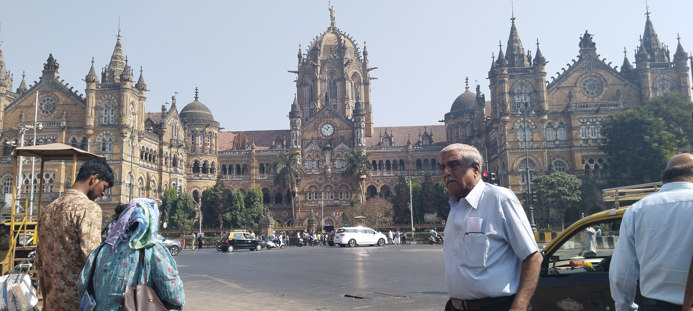
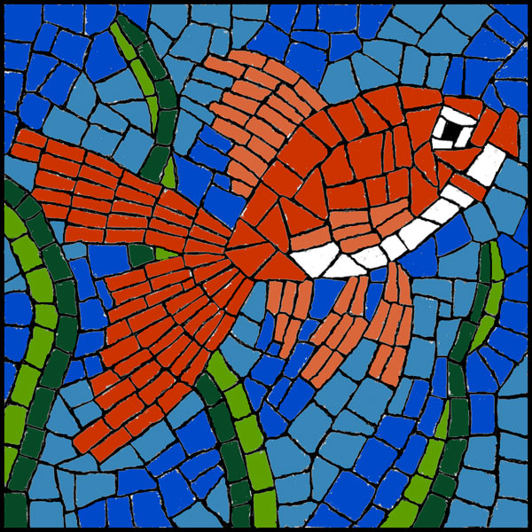

# 🖼️ Neural Style Transfer

[](https://github.com/EquastRiNet/neural-style-transfer/stargazers)
[](https://github.com/EquastRiNet/neural-style-transfer/commits/main)

---

> **I have developed an AI model that blends the style of one image (the style image) into the contents of another image (the content image).**

---

## 🎨 Demo: Style Transfer in Action!

| **Content Image** | **Style Image** | **Stylized Result** |
|:-----------------:|:---------------:|:-------------------:|
|  |  |  |


---

## 🚀 Features

- Blend any two images to create stunning artwork
- Fully implemented in Jupyter Notebook
- Easy to use and customize

---

## 🛠️ Installation

```bash
git clone https://github.com/EquastRiNet/neural-style-transfer.git
```

---

## ✨ Usage

Open the main Jupyter Notebook:

```bash
neural_style_transfer.ipynb
```

Follow the instructions in the notebook to:

1. Upload your **content** and **style** images
2. Run the cells to generate your own stylized masterpiece
3. Save and share your results!

---

## 🖌️ How It Works

> The model uses deep neural networks to extract the *content* from one image and the *style* from another, blending them into a new, unique image.

Created with 🚀 by [EquastRiNet](https://github.com/EquastRiNet)
